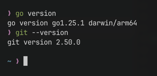
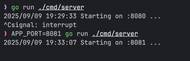
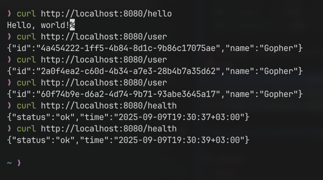
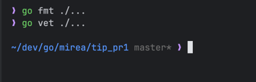

# Рузин Иван Александрович ЭФМО-01-25
# Практическая работа №1

## Структура проекта
```text
pr1/
├─ cmd/
│  └─ server/
│     └─ main.go
├─ screenshots/
├─ go.mod
├─ go.sum
├─ LICENSE
├─ .gitignore
├─ .git/
└─ README.md
```

## Подготовка окружения и проверка версий


## Запуск
```bash
# Установка зависимостей
go mod tidy

# Запуск сервера на 8080
go run ./cmd/server

# Или

# Кастомный порт
APP_PORT=8081 go run ./cmd/server
```



## Маршруты
- `GET /hello` → текст `Hello, world!`
- `GET /user`  → JSON `{ "id": "<uuid>", "name": "Gopher" }`
- `GET /health` → JSON `{ "status": "ok", "time": "<RFC3339>" }`

## Примеры запросов (curl)
```bash
curl http://localhost:8080/hello
curl http://localhost:8080/user
curl http://localhost:8080/health
```



## Код‑стайл и проверки
```bash
make fmt
make vet
```

